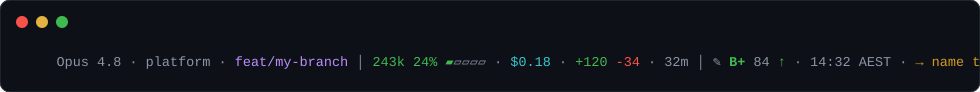

# jm-claude-tools — Claude Code plugin marketplace

A small internal marketplace. Currently ships one plugin:

## `prompt-rater`

Adds a rich status line to the bottom of the Claude Code CLI. Alongside live
session usage, it **grades your most recent prompt** — so you get instant
feedback on how well you're prompting.



```
Opus 4.8 · platform · feat/my-branch │ 243k 24% ▰▱▱▱▱ · $0.18 · +120 -34 · 32m │ ✎ B+ 84 ↑ · 14:32 AEST · → name the file/symbol
```

Segments, left → right:

- **Identity** — model · current dir · git branch (`*` = uncommitted changes)
- **Usage** — context tokens + % of the window (meter; turns red and shows `⚠`
  when nearly full) · session cost · lines added/removed · session duration
- **Prompt** — letter grade + score for your last prompt, a trend arrow
  (`↑/→/↓` vs your recent prompts), the time you sent it (AEST), and a one-line
  tip for the weakest dimension

The grade scores five things a good prompt has — detail, context (filenames/code/
paths), a clear ask, constraints/output format, and success criteria — minus a
penalty for vague phrasing. **Pure local heuristics: no LLM call, zero latency,
zero token cost.** On narrow terminals it drops the lowest-priority segments to
avoid wrapping.

### Configuration (optional)

Drop a `~/.claude/prompt-rater.json` to hide segments or override context-window
size (see `prompt-rater.example.json`):

```json
{ "contextLimit": 1000000, "segments": { "cost": false, "trend": false } }
```

Any segment set to `false` is hidden. Set `PROMPT_RATER_CONFIG` to use a
different path.

### Install

```bash
# Add this marketplace
/plugin marketplace add james-m-swyftx/claude-prompt-rater

# Install the plugin
/plugin install prompt-rater@jm-claude-tools

# Turn the status line on (writes to your ~/.claude/settings.json, with a backup)
/prompt-rater:enable
```

Requires `node` on your PATH (`jq` recommended for safe settings merges).

> **Why the extra `/prompt-rater:enable` step?** Claude Code plugins can't register
> a main-session status line directly — only the user's `settings.json` can. So the
> plugin bundles the script and the enable command wires it in for you. Re-run
> `/prompt-rater:enable` after a plugin update so the path stays current.

### Deep critique on demand — `/prompt-rater:rate-prompt`

The status line is an always-on heuristic. For a real, **LLM-judged** review, run:

```bash
/prompt-rater:rate-prompt              # rates your previous message
/prompt-rater:rate-prompt <draft>      # rates the draft you pass in
```

It scores the prompt against Anthropic's [Claude Code expertise rubric](https://www.anthropic.com/research/claude-code-expertise)
— domain context, success criteria & verification, clear delegation, right
altitude, edge cases — then returns a per-dimension breakdown, the top gaps, and
a rewritten prompt. Costs an API call; use it when a prompt really matters.

### Disable

```bash
/prompt-rater:disable
```

### Layout

```
.claude-plugin/marketplace.json     # marketplace listing
plugins/prompt-rater/
├── .claude-plugin/plugin.json      # plugin manifest
├── statusline-prompt-rater.js      # the status line script
├── prompt-rater.example.json       # sample config
├── commands/                       # /prompt-rater:enable | :disable | :rate-prompt
├── scripts/{enable,disable}.sh     # wire/unwire settings.json
└── test/statusline.test.js         # `node --test` unit tests
```
